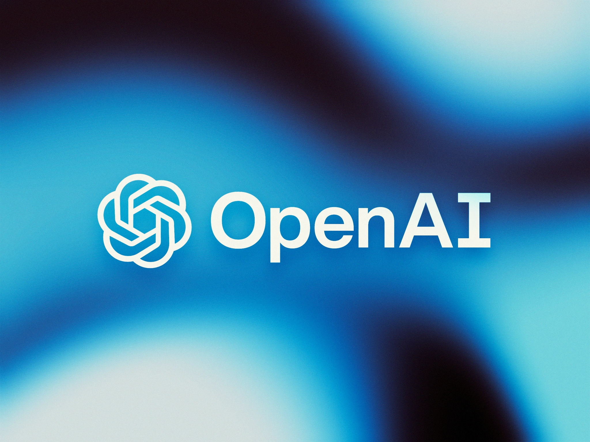

# OpenAI Chatbot



If you are building a chatbot or any other conversational AI application, OpenAI is a great resource to consider. With OpenAI's powerful artificial intelligence technology, you can create chatbots that can understand natural language and generate human-like responses.

## Note

However, there are a few things to note before you start using the OpenAI API for your chatbot. First and foremost, you need to ensure that your OpenAI Credits have not expired. If your credits have been exhausted, your API requests will be denied until you purchase more credits. You can check your credit usage by clicking on the following link.

### `Check Usage:` https://platform.openai.com/account/usage.

Additionally, you need to generate an API Key to make API requests to the OpenAI API. To generate an API Key, click on the following link

### `Get Your Key:` https://platform.openai.com/account/api-keys.

## Setting up Environment variables

To set up this environment variable, you can create a .env file in the root directory of your project and add the following line:

```env
OPENAI_API_KEY=<your-api-key>
```

Replace <your-api-key> with the actual API key that you obtained from the OpenAI website. Make sure to keep this key secure and do not share it with others, as it provides access to your OpenAI account and usage.
